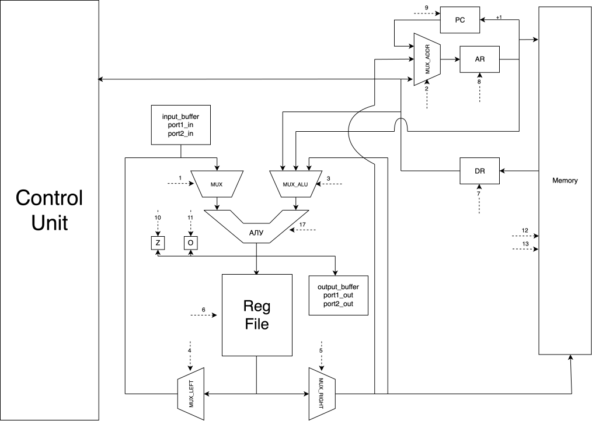

# Транслятор и модель

- Студент: Дубук Даниил Юрьевич
- Преподаватели: Пенской Александр Владимирович.
- `asm | risc | neum | hw | tick -> instr | struct | trap -> stream | port | cstr | prob2 | spi`
- Упрощенный вариант.

## Язык программирования

Используется форма БНФ

`text` - символьный текст состоящий из букв и цифр

``` ebnf
program ::= <оператор> | <метка>

<метка> ::= "text:" <данные> | "text:" <оператор>
<данные> ::= <положительное число> | <резерв> | <текст>


<положительное число> :: <цифра> | <цифра не ноль> { <цифра> }*
<цифра> :: [0-9]
<цифра не ноль> :: [1-9]
<резерв> :: "^"<положительное число>
<текст> :: '"text"'

<оператор> ::= <оп_код> <аргументы>
<оп_код> ::= "inc" | "add" | "minus" | "load" | "save" | "move" |
            "jump" | "jmz" | "jmo" | "read" | "print" | "exit"
<аргументы> ::= <литерал> |
                <прямая адресация> | 
                <загрузка адреса метки> |
<литерал> ::= <положительное число> | 'any symbol'
<прямая адресация> ::= "label"
<загрузка адреса ссылки> ::= "#label"

```

Код выполняется последовательно.

### Набор инструкции

| Инструкция      |                                                 |
|-----------------|-------------------------------------------------|
| MOVE reg, reg   | Перемещает значение из одного регистра в другой |
| LOAD reg, #reg  | Загружает в регист значение по адресу           |
| SAVE #reg, reg  | Сохраняет значение из регистра по адресу        |
| INC reg         | Увеличивает значение регистра на 1              |
| ADD reg, reg    | Складывает значения из регистров                |
| MINUS reg, reg  | Вычитает второй аргумент из первого             |
| JUMP label      | Команда перехода                                |
| JMZ label       | Команда перехода, если 0                        |
| JMO label       | Команда перехода, если нечетное                 |
| READ reg        | Прочитать в регистер из input                   |
| PRINT reg       | Записать значение в output                      |

Память выделяется статически, при запуске модели.
Видимость данных -- глобальная.
Поддержка литералов -- присутствует.

## Организация памяти
- Архитектура памяти - Фон-Неймановская
- Размер машинного слова - 8 бита
- Команды: Реализуются списком словарей, описывающих инструкции (одно слово -- одна ячейка).
- Данные: Линейное адресное пространство. Реализуется списком чисел.

Адресация:

| name  | code       | desc                     |
|-------|------------|--------------------------|
| dir   | any symbol | Прямая загрузка литерала |
| addr  | #label     | Загрузка адреса метки    |
| val   | label      | Прямая адресация         |
| no    |            | Без операнда             |

Механика отображения *данных* на процессор:

- После того как транслятор обработал исходный код в память данных последовательно загружаются данные в виде массива
  целых
  чисел.
- В конце пишется номер первой команды.

Механика отображения *команд* на процессор:

- Все литералы, адреса меток хранятся в памяти команд вместе с инструкциями
- Так же типы адресации хранятся в памяти команд вместе с инструкциями

- Ячейки памяти данных могут и должны использоваться в качестве переменных

- Работа с переменными происходит за счёт работы с памятью данных через метки
- Список словарей копируется в память команд.

Выделять память можно 3 способами

1) ввод значения (число или один символ)
2) резерв на заданное количество ячеек
3) Ввод строки из символов

Все символы заменяются на ascii коды.
Во 2 и 3 пунктах перед данными в память пишется количество занятых ячеек

## Система команд

Особенности процессора:

- Машинное слово -- 8 бит, знаковое.
- Доступ к памяти данных осуществляется по адресу, хранящемуся в  регистре `AR`.
  В данный регистр загружается значение аргумента.
  Программисту напрямую он не доступен. Запись `reg_file` в память и чтение данных из памяти в `reg_file` осуществляется с помощью
  команд `load`, `save` соответственно.
- Обработка данных осуществляется по текущему адресу операциями АЛУ.
- Поддерживается ввод/вывод данных через соответственные буферы. Команды `read`, `print`.
- Поток управления:
    - инкремент `PC` после каждой инструкции;
    - условный (`jmz`), условный (`jmo`) и безусловный (`jump`) переходы.

### Кодирование инструкций

- Машинный код сериализуется в список JSON.
- Один элемент списка -- одна инструкция.
- Индекс списка -- адрес инструкции. Используется для команд перехода.

Пример:

```json
      {
        "opcode": "move",
        "args": [
          "R2",
          0
        ],
        "arg_type": "label_addr",
        "term": "_start:move R2 #request"
      }
```

где:

- `opcode` -- строка с кодом операции;
- `arg` -- аргумент (знаковое число);
- `arg_type` -- Тип адресации для второго аргумента;
- `term` -- информация о связанном месте в исходном коде.

Типы данных в модуле [isa](./src/cpu/isa.py), где:

- `Opcode` -- перечисление кодов операций;
- `Address` -- перечисление типов адресации.

## Транслятор

Интерфейс командной строки: `translator.py <input_file> <target_file>`

Реализовано в модуле: [translator](./src/translation/translator.py)

Этапы трансляции (функция `translate`):

1. Очистка кода: избавление от отступов, комментариев, пустых строк
2. Генерация блока данных и инструкций. Сохранение адресов меток
3. Подстановка адресов меток в инструкции

Правила генерации машинного кода:

- один строка языка -- одна инструкция;
- для всех команд прямое отображение;
- Между `opcode` и аргументом должен быть ровно 1 пробел
- После метки через `": "` сразу должна идти либо инструкция, либо выделение памяти
- Cекция кода начинается с метки `_start:`

## Модель процессора

### DataPath



Реализован в модуле: [Datapath](./src/cpu/data_path.py).

`memory` -- однопортовая память, поэтому либо читаем, либо пишем.

Сигналы (обрабатываются за один такт, реализованы в виде методов класса):

- `latch_reg_addr_new_signal` -- защелкнуть регистр `PC`
- `latch_reg_dr_signal` -- защелкнуть регистр `DR`
- `latch_reg_addr_signal` -- защелкнуть регистр `AR`
- `set_mux_signal` -- установка мультиплексора на левый вход АЛУ 0 - левый мультиплексор; 1 - `input_buffer`; 2, 3 - ввод из портов 1 и 2 соответственно.
- `set_mux_addr_signal` -- установка мультиплексора на `ADDR`: 0 - из `DR`; 1 - из `PC`; 2 - из `reg_file`; 
- `set_mux_alu_signal` -- установка мультиплексора на правый вход АЛУ: 0 - из `DR`; 1 - из `AR`; 2 - из `reg_file`; 
- `set_mux_left_signal` -- установка левого мультиплексора на вывод из `reg_file`
- `set_mux_right_signal` -- установка правого мультиплексора на вывод из `reg_file`
- `latch_flag_z_signal` -- выставить флаг `Z_flag`
- `latch_flag_o_signal` -- выставить флаг `O_flag`
- `latch_reg_file_signal` -- установить значение на выход из `reg_file`
- `latch_output_buffer_signal` -- записать аккумулятор в порт вывода
- `latch_port_out1_signal` -- записать аккумулятор в порт вывода для устройства 1
- `latch_port_out2_signal` -- записать аккумулятор в порт вывода для устройства 2

Флаги:

- `Z_flag` -- отражает наличие нулевого значения.
- `O_flag` -- отражает наличие нулевого четного значения.


### ControlUnit


Реализован в классе в модуле: [ControlUnit](./src/cpu/control_unit.py).
Функции

- `run` -- исполнение инструкций
- `load_program` -- загрузить программу в память

Особенности работы модели:

- Цикл симуляции осуществляется в функции `run`.
- Для журнала состояний процессора используется стандартный модуль `logging`.
- Остановка моделирования осуществляется при:
    - исключении `EmptyBufferError` -- если нет данных для чтения из порта ввода;
    - исключении `ExitError` -- если выполнена инструкция `exit`.

## Тестирование

Тестирование выполняется при помощи golden test-ов.

Конфигурации

- [golden/task1.yml](./tests/golden/task1.yml) Вывод в буфер "hello world". Проверка работы с буфером вывода
- [golden/task2.yml](./tests/golden/task2.yml) Вывод в буфер вывода тест из буфера ввода. Проверка работы с буфером ввода
- [golden/test3.yml](./tests/golden/task3.yml) Запросить имя, и поздороваться с человеком. Проверка работы с памятью.
- [golden/prob2.yml](./tests/golden/prob2.yml) Реализации задачки. Проверка работы логики и математических операций.

#### Prob2

`By considering the terms in the Fibonacci sequence whose values do not exceed four million, find the sum of the even-valued terms.`

Считаются числа фибоначчи, проверяется четность и собирается сумма из четных чисел.

Ответ: 4613732

### Пример использования и журнал работы процессора на примере `cat`:

Запустить тесты: `poetry run pytest . -v`

Обновить конфигурацию golden tests:  `poetry run pytest . -v --update-goldens`

Данный алгоритм должен считать символы из потока ввода и выводить в поток вывода пока буфер не закончится

Код алгоритма:

```asm
  _start:           
      read R1       //чтение из буффера ввода
      print R1      //запись в буффер вывод
      jmz end       //переход в конец, если ввод закончен
      jump _start   //переход в начало цикла
  end:
      exit          //завершение программы
```

Транслированный код

```json
[
  [
    {
      "opcode": "read",
      "args": [
        "R1"
      ],
      "arg_type": "no_op",
      "term": "_start:read R1"
    },
    {
      "opcode": "print",
      "args": [
        "R1"
      ],
      "arg_type": "no_op",
      "term": "print R1"
    },
    {
      "opcode": "jmz",
      "args": [
        4
      ],
      "arg_type": "no_op",
      "term": "jmz end"
    },
    {
      "opcode": "jump",
      "args": [
        0
      ],
      "arg_type": "no_op",
      "term": "jump _start"
    },
    {
      "opcode": "exit",
      "args": [],
      "arg_type": "no_op",
      "term": "end:exit"
    }
  ],
  0
]
```

Входные данные:

`Alisa`

Вывод программы

```
  Alisa 
  instr_counter: 204
```

Пример проверки исходного кода:

``` shell
========================================================================= test session starts =========================================================================
platform darwin -- Python 3.12.4, pytest-7.4.4, pluggy-1.5.0 -- /Users/danek/Library/Caches/pypoetry/virtualenvs/csa-lab3-GbFKG9zz-py3.12/bin/python
cachedir: .pytest_cache
rootdir: /Users/danek/Documents/Univercity/ITMO/AK/lab3/csa-lab3
configfile: pyproject.toml
plugins: golden-0.2.2
collected 4 items                                                                                                                                                     

tests/golden_test.py::test_translator_and_machine[golden/prob2.yml] PASSED                                                                                      [ 25%]
tests/golden_test.py::test_translator_and_machine[golden/task1.yml] PASSED                                                                                      [ 50%]
tests/golden_test.py::test_translator_and_machine[golden/task3.yml] PASSED                                                                                      [ 75%]
tests/golden_test.py::test_translator_and_machine[golden/task2.yml] PASSED                                                                                      [100%]

========================================================================== 4 passed in 0.72s ==========================================================================
poetry run ruff check .
poetry run ruff format .
8 files left unchanged
```

| ФИО                  | алг             | LoC | code байт | code инстр. | такт. | вариант                                                                                                  |
|----------------------|-----------------|-----|-----------|-------------|-------|----------------------------------------------------------------------------------------------------------|
| Дубук Даниил Юрьевич | hello           | 12  | -         | 8           | 611   | `asm \| risc \| neum \| hw \| tick -> instr \| struct \| trap -> stream \| port \| cstr \| prob2 \| spi` | 
| Дубук Даниил Юрьевич | cat             | 7   | -         | 5           | 204   | `asm \| risc \| neum \| hw \| tick -> instr \| struct \| trap -> stream \| port \| cstr \| prob2 \| spi` |
| Дубук Даниил Юрьевич | hello_user_name | 40  | -         | 27          | 1900  | `asm \| risc \| neum \| hw \| tick -> instr \| struct \| trap -> stream \| port \| cstr \| prob2 \| spi` |
| Дубук Даниил Юрьевич | prob2           | 20  | -         | 16          | 2319  | `asm \| risc \| neum \| hw \| tick -> instr \| struct \| trap -> stream \| port \| cstr \| prob2 \| spi` |
                                                                    